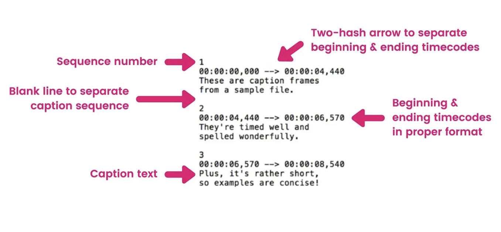

## Show Manager

Show Manager provides helpers to schedule when to play videos.  You can specify a specific time a video should play and in what order to play the videos.  It also provides a way to and sychronize actions with those videos to make much more emersive show


# Show Manager Documentation


- [Show Manager](#show-manager) 
- [Configure Shows](#configure-shows) 
- [Syncing Actions to Video](#Syncing-Actions-to-Video)
- [Run Your Show](#run-your-show) 
- [Event Listeners](#event-listeners) 
- [Display the Show Video](#Display-the-Show-Video)
- [Perform a specific action for a certian show](#Perform-a-specific-action-for-a-certian-show)
- [Enable Debug UI](#Enable-Debug-UI)
- [Show Action Handlers](#Show-Action-Handlers)
- [Make Your Own Show Action Handler](#Make-Your-Show-Action-Handlers)
- [Adjust Logging Levels](#Adjust-Logging-Levels)


## Install

To use any of the helpers provided by this library:

1. Install it as an npm package. Run this command in your scene's project folder:

   ```
   npm i @dcl/show-management
   ```

2. Add this line at the start of your game.ts file, or any other TypeScript files that require it:

   ```ts
   import * as showMgmt from '@dcl/show-management'
   ```

> To be recognized you may also have to add an entry in tsconfig.json
> ```
> sdfs
> ```

## Usage


### Show Manager 

You will need need to create a ShowManager instance to start and assign it a schedule

```ts
import * as showMgmt from 'show-mgmt-dcl'

const showData: showMgmt.ShowDataType = ...

export const SHOW_MGR = new showMgmt.ShowManager()

SHOW_MGR.showSchedule.setData( showData )

```

### Configure Shows

You must create showData that will define what shows to play and when. 

####

```ts
const defaultShow:ShowType = {
  id: -1, //
  title: "Intermission",//the title of the show
  artist: "Artist Name", //name of the artist
  link: DEFAULT_VIDEO, //link to the video, can be internal or external
  subs: IntermissionSubs, //string to a subtitle SRT format
  startTime: -1, //UTC time in seconds for which a show will start
  length: 17, //length of video in seconds
  loop: true //if the video should loop when over
}

const showData: ShowDataType = {
  defaultShow: defaultShow,
  shows: [
		{
		  id: -1, //
		  title: "Title",//the title of the show
		  artist: "Artist Name", //name of the artist
		  link: `videos/tunnelVisuals.mp4`, //link to the video, can be internal or external
		  subs: MySubTitleVar, //string to a subtitle SRT format
		  startTime: 1652117754, //UTC time in seconds for which a show will start
		  length: 17, //length of video in seconds
		  loop: false //if the video should loop when over
		}
	]
```

NOTE:  You maybe tempted to use ISO 8601 date format however there is no garetee 100% support it will be parsed correctly.  ISO 8601 format is the most universally supported however you cannot rely on correct implementation of the standard.  https://en.wikipedia.org/wiki/ISO_8601

```
new Date("2022-05-09T16:39:00-04:00").getTime()/1000 //use at your own risk
```

Here is one of many free helpful converter tools [https://www.epochconverter.com/](https://www.epochconverter.com/) to you convert to date and time to seconds for startTime


#### Configure Show Example

```ts
import * as showMgmt from 'show-mgmt-dcl'

//while testing this can ensure the video start time is always 5 seconds after scene load
const testStartTime = new Date(Date.now() + (5 *1000)).getTime() / 1000   

const showData: showMgmt.ShowDataType = {
  defaultShow: defaultShow,
  shows: [
		defaultShow,
		{ 
	    id: 1,
	    title: 'Demo Show',
	    artist: 'Demo Show',
	    link: `videos/tunnelVisuals.mp4`,
	    subs: DemoShowSubs, //this is a variable holding the SRT format
	    startTime: testStartTime, //start time from UTC in seconds
	    length: 28,
	  }
	]
}
```


### Syncing Actions to Video

To sync action to video we make use of a subtitle file format called SubRip Subtitle (SRT). 

If you would like to learn more about SRT format check these out

* https://en.wikipedia.org/wiki/SubRip
* https://www.3playmedia.com/blog/create-srt-file/

Here is the same SRT example but with comments explaining the components



> Credit https://www.3playmedia.com/blog/create-srt-file/


Here is an example SRT format with actions in it

```
1
00:00:01,000 --> 00:00:01,033
ANNOUNCE {"text":"Welcome to our show","duration":3}
ANIMATE djTable {"animationName":"deckTableOn", "loop":true,"bpmSync":true}
```


See [Show Action Handlers](#Show-Action-Handlers) for how the actions in the subtitle file come to life in your scene

### Run Your Show


You will need need to create a RunOfShowSystem instance should you want the show to play by it self when the startTime dictage

```ts
import * as showMgmt from 'show-mgmt-dcl'

export const runOfShow = new showMgmt.RunOfShowSystem(SHOW_MGR)
engine.addSystem(runOfShow)

```


### Event Listeners

The Show Manager has no knowlege of your scene and how it should react to the videos.  So your scene react to show events registering to the provided event listeners

* addStopShowListeners
* addPlayVideoListeners
* addVideoStatusChangeListener

```ts
import * as showMgmt from 'show-mgmt-dcl'

SHOW_MGR.addStopShowListeners( (event:showMgmt.StopShowEvent)=>{
  log("addStopShowListeners fired",event)
  
  ...  
} )

 
SHOW_MGR.addPlayVideoListeners( (event:showMgmt.PlayShowEvent)=>{
  log("addPlayVideoListeners fired",event)
  
  ...
} )

SHOW_MGR.addVideoStatusChangeListener( new showMgmt.VideoChangeStatusListener((oldStatus: VideoStatus, newStatus: VideoStatus)=>{
  log("addVideoStatuChangeListener fired",oldStatus,newStatus)
  
  switch(newStatus){
    case VideoStatus.LOADING:

    break;
    ...
  }

} ))

```

### Display the Show Video


The Show Manager will create a video texture but does not know where to put it in your scene.  You can register to SHOW_MGR.addPlayVideoListeners and assign the video texture where it needs to go.

```ts

export const videoMat = new Material()

//create video material
videoMat.castShadows = false
videoMat.metallic = 0
videoMat.roughness = 1
videoMat.emissiveIntensity = 1
videoMat.emissiveColor = Color3.White()
videoMat.alphaTest = 1

//create entity
export const myScreenEntity = new Entity()
const myScreenPlane = new PlaneShape()
myScreenEntity.addComponent(myScreenPlane)

//add material
myScreenEntity.addComponent(videoMat)

//add to engine
engine.addEntity(myScreenEntity)

SHOW_MGR.addPlayVideoListeners( (event:showMgmt.PlayShowEvent)=>{
  log("addPlayVideoListeners fired",event)
  
  //assign the playing video to a material so it can be visible in scene
  if(event.videoTexture){ 
    videoMat.albedoTexture = event.videoTexture
    videoMat.alphaTexture  = event.videoTexture
    videoMat.emissiveTexture = event.videoTexture
  }
} )
```

### Perform a specific action for a certian show

In this example I want to show a countdown to when the next show will be.  Register a listener to  addPlayVideoListeners and perform your logic there

```ts
SHOW_MGR.addPlayVideoListeners( (event:showMgmt.PlayShowEvent)=>{
  log("addPlayVideoListeners fired",event)

  //if I know the intermission show ID I can check for it and perform a very specific action
  if(event.showData.id == -1){ 
    const showRange = SHOW_MGR.showSchedule.findShowToPlayByDate( new Date() ) 
    if(showRange.nextShow && showRange.nextShow.show){   
	    startNextShowCounter(showRange.nextShow)
    } 
  }else{
  	hideShowCounter()
  }
 
} )

```


### Enable Debug UI

```ts
 
isPreviewMode().then(preview=>{
  if(preview) {
    SHOW_MGR.enableDebugUI(preview)
    registerWithDebugUI( SHOW_MGR.manageShowDebugUI,SHOW_MGR, runOfShow  ) 
  }
})

```

### Show Action Handlers

Show action handlers are what convert the commands in the subtitle file into something in your scene

There are three types of handlers provided.  Ones that have all the functionality they need and some that need you extend them.  The latter require you to define how they function because there is no way to know exactly how each show will want to implement it.  For example the PAUSE action could mean lots of things, pause 1 animation but play another, hide one entity but show a different entity.  There is no way to predict all this so you must define it.  The third type are onces that you make yourself.

Provided handlers with all functionality provided include

* ShowAnimationActionHandler
* ShowBpmActionHandler
* DefineTargetGroupActionHandler
* ShowAnounceActionHandler

Handlers that are recommended you to extend them by defining how they should function

* ShowPauseAllActionHandler
* ShowStopAllActionHandler

#### Override Action Handler Behavior

To define override an action handler should behave, you must provide a process method.  In this example here it defines how the Anounce action handler should behave.

You can initiate your own version of the class

```ts
SHOW_MGR.actionMgr.registerHandler(
  new showMgmt.ShowAnounceActionHandler( {
    process(action: showMgmt.ActionParams<showMgmt.ActionHandlerAnouncementParams>, showActionMgr: showMgmt.ShowActionManager): void {
      //my custom process logic
      ui.displayAnnouncement(action.params.text,action.params.duration)
    }
  } )
)
```

OR fetch the existing one and overwrite its process callback

```ts
//example of how to extend the action by setting processExt callback
const accounceHandler:showMgmt.ShowAnounceActionHandler 
  = SHOW_MGR.actionMgr.getRegisteredHandler<showMgmt.ShowAnounceActionHandler>(showMgmt.ShowAnounceActionHandler.DEFAULT_NAME)

accounceHandler.process = (action: showMgmt.ActionParams<showMgmt.ActionHandlerAnouncementParams>, showActionMgr: showMgmt.ShowActionManager): boolean {
  const METHOD_NAME = "process"
  accounceHandler.logger.debug(METHOD_NAME,"called",action)

  return true
}
```

#### Extend Action Handler Behavior

To extend an action handler behavior, can provide processExt method.  In this example here it defines how to extend PauseAll action handler.

```ts
//example of how to extend the action by setting processExt callback
const pauseHandler:showMgmt.ShowPauseAllActionHandler 
  = SHOW_MGR.actionMgr.getRegisteredHandler<showMgmt.ShowPauseAllActionHandler>(showMgmt.ShowPauseAllActionHandler.DEFAULT_NAME)

pauseHandler.processExt = (action: showMgmt.ActionParams<string>, showActionMgr: showMgmt.ShowActionManager): boolean {
  const METHOD_NAME = "processExt"
  pauseHandler.logger.debug(METHOD_NAME,"called",action)

  //pause actions goes here
  //some actions "stop" is a play or hide or show or stop

  return true
}
```

OR add an onProcessListerner.  The benefit of this is you can register as many actions as you need when you need. 

```ts

//example of how to extend the action by setting processExt callback
const pauseHandler:showMgmt.ShowPauseAllActionHandler 
  = SHOW_MGR.actionMgr.getRegisteredHandler<showMgmt.ShowPauseAllActionHandler>(showMgmt.ShowPauseAllActionHandler.DEFAULT_NAME)

pauseHandler.addOnProcessListener( (action: showMgmt.ActionParams<string>, showActionMgr: showMgmt.ShowActionManager): boolean => {
  const METHOD_NAME = "addOnProcessListener"
  pauseHandler.logger.debug(METHOD_NAME,"called",action)

  //pause actions goes here
  //some actions "stop" is a play or hide or show or stop

  return true
})
```

### Make Your Own Show Action Handler

Here is an example of how to make your very own action handler.  In this example we make a new action named "SAY" followed by the text to be said and register it to the show manager.

An example where no arguments are required

```ts
SHOW_MGR.actionMgr.registerHandler(
  new  showMgmt.ShowBasicActionHandler( 
    "SAY_HI",
    {
      process(action: showMgmt.ActionParams<string>, showActionMgr: showMgmt.ShowActionManager): boolean {
        ui.displayAnnouncement('HI',1)
        return true 
      }
    } )
)
```

Example where you want to pass arguments.  The library provides a basic parser ```showMgmt.parseActionWithOpts```.  Expected a pattern of: 

```
ACTION_NAME TEXT_NO_SPACES TEXT_NO_SPACES2 ... (optional JSON string to be parsed as the very end) 
```

Implement your own for your own needs.

```ts

//define custom parameter object type
type ActionTypeSay={
  text?:string
  duration?:number
}

//action will be used as follows
//SAY words {"duration":"1"}
SHOW_MGR.actionMgr.registerHandler(
  new  showMgmt.ShowActionHandlerSupport<ActionTypeSay>( 
    "SAY",
    {
      matches(action: string,showActionMgr:showMgmt.ShowActionManager):boolean{ 
        return showMgmt.actionStartsWith(action,this.getName(),0," ")
      },
      decodeAction(action: string, showActionMgr: showMgmt.ShowActionManager):showMgmt.ActionParams<ActionTypeSay>{
        logger.debug("ACTION.SAY.decodeAction","called",action)
        const decoded = showMgmt.parseActionWithOpts<ActionTypeSay>(action)
        
        let text = ""
        //join the params back together, all except the json one
        //it woudl be easier to just pass the text as part of the json 
        //this is to demonstrate how you can transform the parsed params if need be
        for(let x=1;x<decoded.array.length;x++){
          const txt = decoded.array[x]
          //check for beginning of json
          if(txt.charAt(0)=='{')  break; 
          text += txt + " "
        }

        if(!decoded.params) decoded.params = {}
        if(!decoded.params.text) decoded.params.text = text

        return  decoded;
      },
      process(action: showMgmt.ActionParams<ActionTypeSay>, showActionMgr: showMgmt.ShowActionManager): boolean {
        const duration = action.params.duration ? action.params.duration : 1
        ui.displayAnnouncement(action.params.text,duration)

        return true
      }
    } )
)
```

### Adjust Logging Levels

To avoid flooding logs each class has its own logger named by class name.  You can adjust logging levels for all classes or just a few to suit your needs

Classes of interest

* ShowManager - manager class that is called to play shows
* RunOfShowSystem - system that processes showSchedule and decides which show to play at the correct time
* SubtitleVideoSystem - system that processes video events
* SubtitleSystem - system that handles processing subtitles
* ShowActionManager - processes an actions to be sent to a handler
* ShowActionHandler - the action handlers them self


```ts
//create a named logger
const logger:showMgmt.Logger = showMgmt.LoggerFactory.getLogger("MyScene.ShowSetup.ts")

//set logger for a specific logger
logger.setLevel(showMgmt.LogLevel.DEBUG)

//will set default logging level for all loggers
showMgmt.LoggingConfiguration.getInstance().defaultLevel = showMgmt.LogLevel.DEBUG

//set logger for a specific action handler logger
const logHandlerAnimation = showMgmt.LoggerFactory.getLogger("ShowActionHandler."+showMgmt.ShowAnimationActionHandler.DEFAULT_NAME)
if(logHandlerAnimation) logHandlerAnimation.setLevel(showMgmt.LogLevel.TRACE)


```

## Copyright info

This scene is protected with a standard Apache 2 licence. See the terms and conditions in the [LICENSE](/LICENSE) file.
